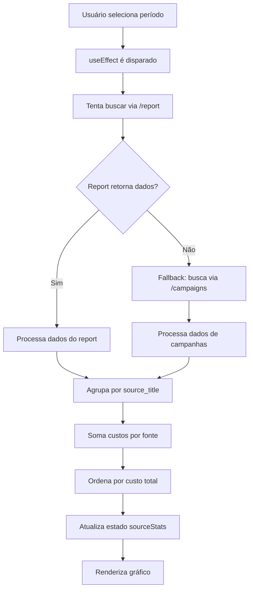

# 💰 Investimento por Fonte de Tráfego - Dashboard TrackView

## 📋 Visão Geral

O bloco "Investimento por Fonte de Tráfego" no Dashboard do TrackView exibe o gasto total de cada fonte de tráfego (Facebook Ads, Google Ads, TikTok, etc.) para o período selecionado, permitindo uma análise clara de onde o dinheiro está sendo investido.

## 🔧 Como Funciona

### 1. **Busca de Dados**
- **Método Principal**: Tenta buscar dados via endpoint `/report` com `group_by: 'source'`
- **Método Fallback**: Se o report não retornar dados, busca via endpoint `/campaigns` com `group_by: 'campaign'`
- **Período**: Usa o período selecionado no seletor de datas do dashboard

### 2. **Processamento dos Dados**
- **Agrupamento**: Agrupa campanhas por `source_title` (título da fonte de tráfego)
- **Soma de Custos**: Soma o campo `cost` de todas as campanhas de cada fonte
- **Filtragem**: Considera apenas fontes com custo > 0
- **Ordenação**: Ordena por custo total (maior para menor)

### 3. **Exibição**
- **Gráfico de Barras Horizontais**: Cada barra representa uma fonte de tráfego
- **Valor Total**: Mostra o total investido no topo direito do bloco
- **Tooltip Interativo**: Exibe detalhes ao passar o mouse sobre as barras
- **Responsivo**: Adapta-se ao tamanho da tela

## 📊 Estrutura dos Dados

### Dados de Entrada (RedTrack API)
```json
{
  "source_title": "Facebook Ads",
  "cost": 1500.50,
  "clicks": 2500,
  "conversions": 45,
  "revenue": 3200.00
}
```

### Dados Processados (Dashboard)
```json
{
  "key": "Facebook Ads",
  "cost": 1500.50
}
```

## 🎯 Campos Utilizados

### Campos Principais
- **`source_title`**: Nome da fonte de tráfego (Facebook Ads, Google Ads, etc.)
- **`cost`**: Custo total da campanha/fonte
- **`date_from`**: Data inicial do período
- **`date_to`**: Data final do período

### Campos de Fallback
- **`source`**: Campo alternativo para fonte de tráfego
- **`campaign.title`**: Nome da campanha (usado no fallback)

## 🔄 Fluxo de Execução



## 🚀 Otimizações Implementadas

### 1. **Busca Inteligente**
- Primeiro tenta o endpoint mais eficiente (`/report`)
- Fallback para endpoint alternativo se necessário
- Logs detalhados para debugging

### 2. **Cache e Performance**
- Dados são buscados apenas quando necessário
- Estado local para evitar re-renderizações desnecessárias
- Tratamento de erros robusto

### 3. **UX Melhorada**
- Indicador visual de carregamento
- Mensagens informativas quando não há dados
- Tooltip rico com informações detalhadas
- Total de investimento sempre visível

## 🐛 Troubleshooting

### Problema: "Sem dados de investimento por fonte"
**Possíveis Causas:**
1. Campanhas não têm dados de custo configurados
2. Período selecionado não tem dados
3. API Key inválida ou expirada
4. Plano RedTrack não permite relatórios de custo

**Soluções:**
1. Verificar se as campanhas têm custos configurados no RedTrack
2. Tentar um período diferente
3. Verificar a API Key nas configurações
4. Contatar suporte RedTrack sobre permissões

### Problema: Dados incorretos ou desatualizados
**Possíveis Causas:**
1. Cache desatualizado
2. Dados não sincronizados no RedTrack
3. Problemas de timezone

**Soluções:**
1. Recarregar a página (Ctrl+F5)
2. Verificar sincronização no RedTrack
3. Verificar configurações de timezone

## 📈 Métricas Relacionadas

### Métricas de Performance
- **ROI por Fonte**: `(revenue - cost) / cost * 100`
- **CPC por Fonte**: `cost / clicks`
- **CPA por Fonte**: `cost / conversions`
- **CTR por Fonte**: `clicks / impressions * 100`

### Integrações Futuras
- Comparação com períodos anteriores
- Projeções baseadas em histórico
- Alertas de orçamento por fonte
- Exportação de relatórios

## 🔗 Arquivos Relacionados

- **Componente**: `src/components/Dashboard.tsx`
- **API**: `api/campaigns.js`
- **Serviços**: `src/services/api.ts`
- **Store**: `src/store/dateRange.ts`

## 📝 Notas de Implementação

### Dependências
- **Recharts**: Para renderização dos gráficos
- **Framer Motion**: Para animações
- **RedTrack API**: Para busca de dados

### Considerações Técnicas
- Os dados são buscados em tempo real
- Não há cache persistente (apenas estado local)
- Tratamento de erros robusto com fallbacks
- Interface responsiva e acessível

### Limitações Atuais
- Máximo de 8 fontes exibidas no gráfico
- Dados são agregados por período (não tempo real)
- Não há histórico de mudanças de custo

---

**Desenvolvido para TrackView Dashboard**  
*Última atualização: Dezembro 2024*
